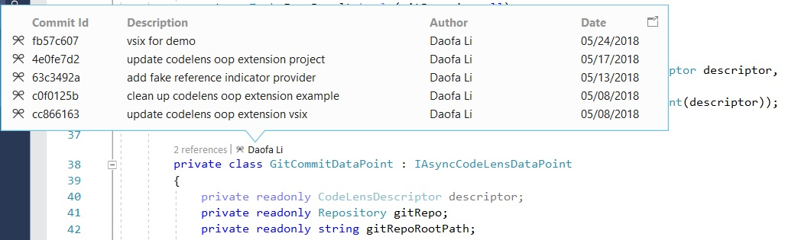

# CodeLensOopProvider example 
An example for demonstrating how to use the public CodeLens API to create an out-of-proc extension that provides a CodeLens indicator showing most recent Git commits made to the source code.

* Technologies: Visual Studio 2019 SDK
* Topics: CodeLens

**Description**

This example generates a VSIX extension that packs two components:
* **CodeLensOopProvider.dll**: This assembly contains a CodeLens data point provider that retrieves most recent commits from the git repo where the source code is committed. This assembly is loaded by the CodeLens service which runs out of the Visual Studio process.
* **CodeLensOopProviderVsix.dll**: This assembly provides a VSPackage which handles the command invoked when a user clicks on a commit from the commit indicator detail pane and an MEF component providing a ViewElementFactory that is able to convert custom data objects provided by the data point into a visual presentation. This assembly is loaded by the Visual Studio process.
* **CodeLensOopProviderShared.dll**: This assembly contains data structures shared by the two previous projects. This assembly is loaded by both the CodeLens service which runs out of the Visual Studio process and by the Visual Studio process.



**Requirements**

The example requires Visual Studio 2019 16.1 and above, Community SKU and above.

**Getting Started**

1. Clone the repo: 
   `git clone https://github.com/Microsoft/VSSDK-Extensibility-Samples.git`
2. To run the example, hit F5 or choose the **Debug &gt; Start Debugging** menu command. A new instance of Visual Studio will launch under the experimental hive.
3. Open a solution from a local git repo, for example, this example solution.
4. Open a source code file, you will see the git commit lens indicator along with other CodeLens indicators in the editor.

**How it works**

1. Separate the in-proc and out-of-proc (OOP) components.

   The CodeLens data point provider has to run out-of-proc; while the VSPackage providing an IOleCommandTarget
   for handling navigation needs to be loaded in-proc. To meet these requirements, this VSIX is split into two projects:
   * **CodeLensOopProvider**: A library project that implements a CodeLens data point provider. The assembly runs out-of-proc.
   * **CodeLensOopProviderVsix**: A VSIX project that provides the VSPackage and implements IOleCommandTarget for handling navigation. The assembly runs in-proc.

2. Make sure the out-of-proc assembly can be discovered and loaded by the CodeLens service.

   The assembly that will be loaded by the CodeLens service process must be added as an asset of type `Microsoft.VisualStudio.CodeLensComponent`
   to the VSIX's extension.vsixmanifest file:

   ```xml
      <!-- This is the magic to make it get loaded by the OOP service -->
      <Asset Type="Microsoft.VisualStudio.CodeLensComponent" d:Source="Project" d:ProjectName="CodeLensOopProvider" Path="|CodeLensOopProvider|" />
   ```
3. Implement `IAsyncCodeLensDataPointProvider` and `IAsyncCodeLensDataPoint` in the out-of-proc assembly.

	```c#
	[Export(typeof(IAsyncCodeLensDataPointProvider))]
    [Name(Id)]
    [ContentType("code")]
    [LocalizedName(typeof(Resources), "GitCommitCodeLensProvider")]
    [Priority(200)]
    internal class GitCommitDataPointProvider : IAsyncCodeLensDataPointProvider

    private class GitCommitDataPoint : IAsyncCodeLensDataPoint
	```
	
	Refer to the API documentation for the data point provider attributes.

4. Handle navigate command invoked from the lens Details popup.

   To respond to a user's clicking on the items in the Detail popup, the in-proc VSPackage needs to implement `IOleCommandTarget` and handle the navigation command:

   ```c#
   public sealed class CodeLensOopProviderPackage : AsyncPackage, IOleCommandTarget

    private static void NavigateToCommit(string commitId, IServiceProvider serviceProvider)
    {
        string title = "CodeLens OOP Extension";
        string message = $"Commit Id is: {commitId}";

        // Show a message box to prove we were here
        VsShellUtilities.ShowMessageBox(
            serviceProvider,
            message,
            title,
            OLEMSGICON.OLEMSGICON_INFO,
            OLEMSGBUTTON.OLEMSGBUTTON_OK,
            OLEMSGDEFBUTTON.OLEMSGDEFBUTTON_FIRST);
    }
   ```

5. Custom details UI.

   In addition to standard CodeLensDetailsDescriptor.Entries, GitCommitDataPointProvider also provides a CodeLensDetailsDescriptor.CustomData instance, which is an object of type `GitCommitCustomDetailsData`.

   ```c#
   var result = new CodeLensDetailsDescriptor()
   {
       Headers = CreateHeaders(),
       Entries = CreateEntries(commits),
       CustomData = new List<GitCommitCustomDetailsData>()
       {
           new GitCommitCustomDetailsData() 
           {
               CommitDescription = firstCommit.Message,
               CommitAuthor = firstCommit.Author.Name,
               CommitSha = firstCommit.Sha
           }
       },

   ```

   The `ViewElementFactory` class in the CodeLensOopProviderVsix project converts `GitCommitCustomDetailsData` into a visual representation that is shown in the Details popup.

   ```c#
    [Export(typeof(IViewElementFactory))]
    [Name("Git commit details UI factory")]
    [TypeConversion(from: typeof(GitCommitCustomDetailsData), to: typeof(FrameworkElement))]
    [Order]
    internal class ViewElementFactory : IViewElementFactory
    {
        public TView CreateViewElement<TView>(ITextView textView, object model) where TView : class
        {
            // Should never happen if the service's code is correct, but it's good to be paranoid.
            if (typeof(FrameworkElement) != typeof(TView))
            {
                throw new ArgumentException($"Invalid type conversion. Unsupported {nameof(model)} or {nameof(TView)} type");
            }

            if (model is GitCommitCustomDetailsData detailsData)
            {
                var detailsUI = new GitCommitDetails();
                detailsUI.DataContext = detailsData;
                return detailsUI as TView;
            }

            return null;
        }
    }
   ```

**Notes**

- As of Visual Studio 16.3.2 the version of StreamJsonRPC must be 1.5.x or lower in proc, which means the Microsoft.VisualStudio.Language package version has to be 16.0.467 or lower as a released version.
- You can check the latest versions of packages supported by the Visual Studio IDE in proc by looking at the binding redirects inside devenv.exe.config.
- The out of proc can use the latest 2.x version of StreamJsonRPC and the latest version of Microsoft.VisualStudio.Language.

