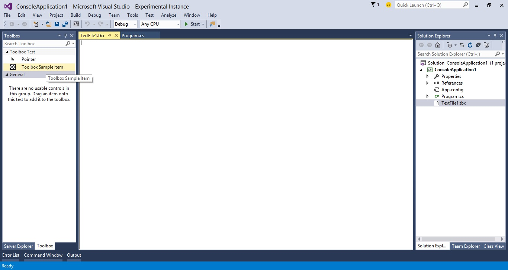

# Editor With Toolbox Sample
Modify the Editor to support a custom file type and construct
toolbox items for the document in Visual Studio.

* Technologies: Visual Studio 2015 SDK
* Topics: Visual Studio Shell, VSX

**Description**

This sample demonstrates how to create a package that provides an Editor type
extended with Toolbox support. The Editor Toolbox will have custom options
available whenever a .tbx file is opened.

Goals:

  * Provide an editor factory. 
  * Document integration and persistence. 
  * Toolbox integration 
  * Handle source-controlled and read-only files. 

**Requirements**

[ Visual Studio 2015 ](https://www.visualstudio.com/products/visual-studio-community-vs?wt.mc_id=o~display~github~vssdk)

**Get all samples**

Clone the repo ([How to](https://git-scm.com/book/en/v2/Git-Basics-Getting-a-Git-Repository#Cloning-an-Existing-Repository)):

`git clone https://github.com/Microsoft/VSSDK-Extensibility-Samples.git`

**Run the sample**

  1. To run the sample, hit F5 or choose the **Debug &gt; Start Debugging** menu command. A new instance of Visual Studio will launch under the experimental hive. 
  2. Once loaded, create new project (e.g. a C# ConsoleApplication) 
  3. Right-click the project in the **File Explorer**. Click **Add &gt; New File**
  4. In the **Add New File** dialog, select **Text File** from the list of options. 
  5. Change the suggested filename to have 'TBX' as a file extension e.g. _TextFile1.tbx_. 
  6. Click **Add** to add the new file to your project and close the dialog box 
  7. The VSPackage opens a new file tab with the embedded rich textbox. 
  8. Click **View &gt; Toolbox** to launch the Toolbox window. The window contains a **Toolbox Test** tab. As with all toolbox tabs, it has a Pointer tool. Drag the **Toolbox Sample Item** tool into the .tbx file window. 
  9. **NOTE**: If your toolbox does not have a **Toolbox Test** tab or **Toolbox Sample Item** tool, make sure you have a .tbx file as the active file. The tab and tool are registered specifically to the .tbx file editor. 

**Source Code Overview**

This sample implements an editor for a.tbx** plain text file. The actual UI
of this designer is simply a **RichTextBox** control. This sample demonstrates
how to implement integration with Visual Studio Toolbox within the Editor.

The Editor uses **SVsToolbox** service and implements **IVsToolboxUser** in
order to support Toolbox integration. It handles toolbox items availability
and supports drag and drop text from the toolbox.

**Related topics**

* [ Toolbox Documentation ](https://msdn.microsoft.com/en-us/library/ee712574(v=vs.140).aspx)

* [ Editor Documentation ](https://msdn.microsoft.com/en-us/library/dd885242(v=vs.140).aspx)

* [ Visual Studio SDK Documentation ](https://msdn.microsoft.com/en-us/library/bb166441(v=vs.140).aspx)

