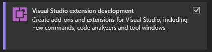
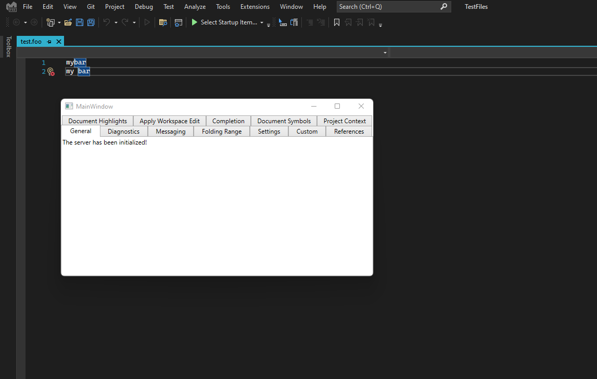

# Language Server Protocol Sample
This sample creates a mock language server using the [common language server protocol](https://github.com/Microsoft/language-server-protocol/blob/master/protocol.md) and a mock language client extension in Visual Studio.  For more information on how to create language server extensions in Visual Studio, please see [here](https://docs.microsoft.com/en-us/visualstudio/extensibility/adding-an-lsp-extension).

**Requirements**
* [ Visual Studio 2022](https://visualstudio.microsoft.com/thank-you-downloading-visual-studio/?sku=Community&channel=Release&version=VS2022).
* Install with the 'Visual Studio extension development' workload

**Run the sample**
* To build and execute the sample, press F5 after the sample is loaded.
* In the experimental instance of Visual Studio, open a *.foo file in [Test Files](MockLanguageExtension/TestFiles)
* You will start the language server and see a UI displayed like this:

* You can go to the various tabs to play around with the various features supported.

**Related topics**
* [Language Server Protocol](https://docs.microsoft.com/en-us/visualstudio/extensibility/language-server-protocol)
* [Creating a language server extension in Visual Studio](https://docs.microsoft.com/en-us/visualstudio/extensibility/adding-an-lsp-extension)
* [ Visual Studio SDK Documentation ](https://docs.microsoft.com/en-us/visualstudio/extensibility/visual-studio-sdk)