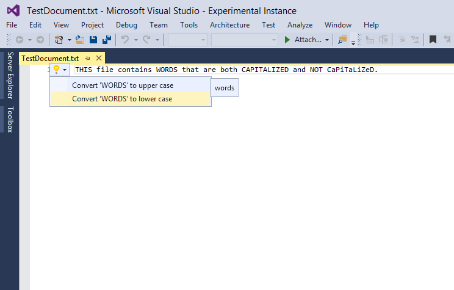

# Title: LightBulb API Sample
**Abstract:** This sample provides custom LightBulb functionality for txt
files.

* Technologies: Visual Studio 2015 SDK
* Topics: Visual Studio Editor, VSX

**Description**

This sample for Visual Studio 2015 modifies the LightBulb API to provide
custom content for .txt files. Whenever the text caret is placed over a word,
the lightbulb adornment appears. The lightbulb will provide to options, you
can choose to make the word entirely uppercase or entirely lowercase.

**Requirements**

[ Visual Studio 2015 ](http://www.microsoft.com/visualstudio/en-us/try/default.mspx#download)

[ Visual Studio 2015 SDK ](https://www.visualstudio.com/en-us/downloads/visual-studio-2015-downloads-vs.aspx)

**Run the sample**

  * To build and execute the sample, press F5 after the sample is loaded 
  * Open a .txt file in the Visual Studio Editor
  * Click on a word in the text file. (place the text caret on that word)
  * A lightbulb appears on the same line as the selected word
  * Click on the lightbulb to see the list of suggested actions
  * The selected word can be converted to all uppercase or all lowercase characters

**Related topics**

* [ Light Bulb Documentation ](https://msdn.microsoft.com/en-us/library/dn872466(v=vs.140).aspx)

* [ Editor Documentation ](https://msdn.microsoft.com/en-us/library/dd885242(v=vs.140).aspx)

* [ Visual Studio SDK Documentation ](https://msdn.microsoft.com/en-us/library/bb166441(v=vs.140).aspx)

