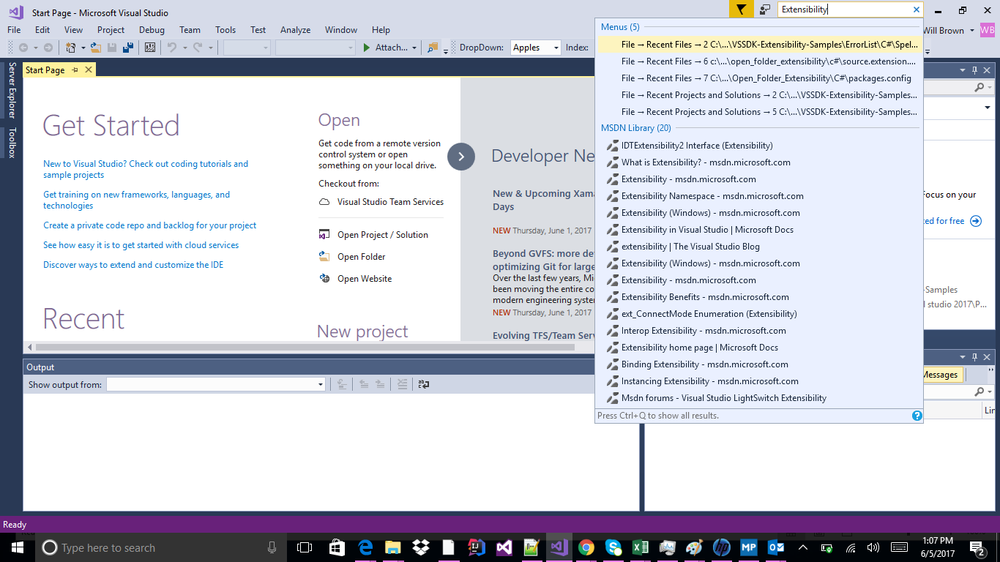

# MSDN Search Sample
Demonstrate how to extend Quick Launch with custom search
providers in Visual Studio.

* Technologies: Visual Studio 2017 SDK
* Topics: MSBuild, VSX

**Description**

This sample demonstrates how to extend **Quick Launch** to include additional
search providers that search outside of the built-in providers. The list of
search providers can be found at: **Tools &gt; Options &gt; Environment &gt; Quick
Launch**

  * This sample implements **MSDN Search** functionality into **Quick Launch**

**Requirements**

[ Visual Studio 2017 ](https://www.visualstudio.com/products/visual-studio-community-vs?wt.mc_id=o~display~github~vssdk)

**Get all samples**

Clone the repo ([How to](https://git-scm.com/book/en/v2/Git-Basics-Getting-a-Git-Repository#Cloning-an-Existing-Repository)):

`git clone https://github.com/Microsoft/VSSDK-Extensibility-Samples.git`

**Run the sample**

  1. To run the sample, hit F5 or choose the **Debug &gt; Start Debugging** menu command. A new instance of Visual Studio will launch under the experimental hive. 
  2. Once loaded, click on the **Quick Launch** search bar in the top right corner of Visual Studio 
  3. _MSDN_ is now one of the search providers that will display results in **Quick Launch**
  4. _MSDN Search_ now appears in the list of search providers. **Tools &gt; Options &gt; Environment &gt; Quick Launch**
  5. To reduce the scope of a search to only include **MSDN**, prefix the search string with _@msdn_. Ex: _@msdn hello world_

**Project Files**

* **MSDNSearchPackage.cs**

This file contains the ExtensionPointPackage implementation. Declares the
supported extension points (the Quick Launch search provider). It also is
responsible for declaring About Box registration data.

* **MSDNSearchProvider.cs**

This file contains the search provider implementation. The class implements
the IVsSearchProvider interface that enables Quick Launch integration.

* **MSDNSearchResult.cs**

This class represents a search result from MSDN Search category. It exposes
properties such as DisplayText, Tooltip, and implements the action to be
executed when the search result is selected by the user.

* **MSDNSearchTask.cs**

This class derives from Microsoft.VisualStudio.Shell.VsSearchTask and
implements the task used to perform the actual searches. It queries the MSDN
online server, process the returned RSS feed and creates search results to be
displayed in the Quick Launch popup.

* **VSPackage.resx**

This file is used to support localized strings and images for About Box
registration

**Related topics**

 * [ Editor Documentation ](https://docs.microsoft.com/en-us/visualstudio/extensibility/editor-and-language-service-extensions)
* [ User Settings and Options ](https://docs.microsoft.com/en-us/visualstudio/extensibility/extending-user-settings-and-options)

 * [ Visual Studio SDK Documentation ](https://docs.microsoft.com/en-us/visualstudio/extensibility/visual-studio-sdk)

