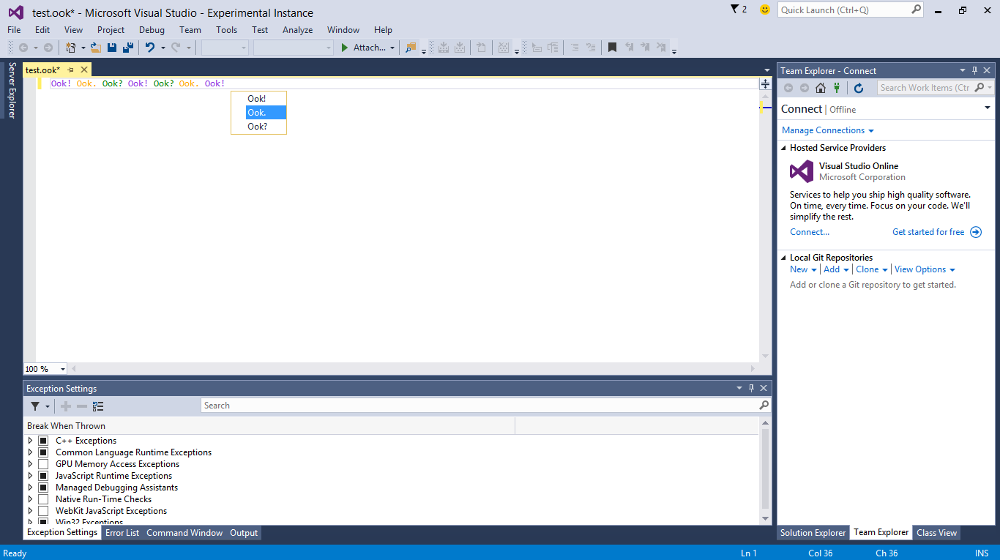

# Ook Language Integration Sample
Implement custom language support into Visual Studio for the
esoteric language 'Ook!'.

* Technologies: Visual Studio 2015 SDK
* Topics: Visual Studio Editor, VSX

**Description**

This sample implements_Ook!_, an esoteric example language consisting of three
valid tokens separated by spaces: **Ook!**, **Ook?**, and **Ook.**

The _Ook!_ language supports the following features:

  * General purpose token tagger 
  * A classification tagger 
  * A QuickInfo source and controller 
  * A completion source and controller 

**Requirements**

[ Visual Studio 2015 ](https://www.visualstudio.com/products/visual-studio-community-vs?wt.mc_id=o~display~github~vssdk)

**Get all samples**

Clone the repo ([How to](https://git-scm.com/book/en/v2/Git-Basics-Getting-a-Git-Repository#Cloning-an-Existing-Repository)):

`git clone https://github.com/Microsoft/VSSDK-Extensibility-Samples.git`

**Run the sample**

  1. To run the sample, hit F5 or choose the **Debug &gt; Start Debugging** menu command. A new instance of Visual Studio will launch under the experimental hive. 
  2. Once loaded, open a file with the .ook filename extension. This sample includes an example .ook file: _test.ook_
  3. Instances of "Ook!" are colored Purple 
  4. Instances of "Ook?" are colored Green 
  5. Instances of "Ook." are colored Yellow 
  6. Test Completion: Click anywhere in the file and press **Space**. An auto-complete dialog should appear at the location of the text caret 
  7. Test QuickInfo: Position the mouse cursor over a valid token. Text appears in a grey box describing the purpose of the token. 

**Notes**

This example was used during the Visual Studio Ecosystem Summit Presentation
"Getting Linguistic: Integrating a Language into Visual Studio" by Chris
Granger. The video can be found [here](https://channel9.msdn.com/blogs/vsipmarketing/vsx212-adding-a-language-service-into-visual-studio-2010).

**Related topics**

* [ Editor Documentation ](https://msdn.microsoft.com/en-us/library/dd885118(v=vs.140).aspx)

* [ Visual Studio SDK Documentation ](https://msdn.microsoft.com/en-us/library/bb166441(v=vs.140).aspx)

