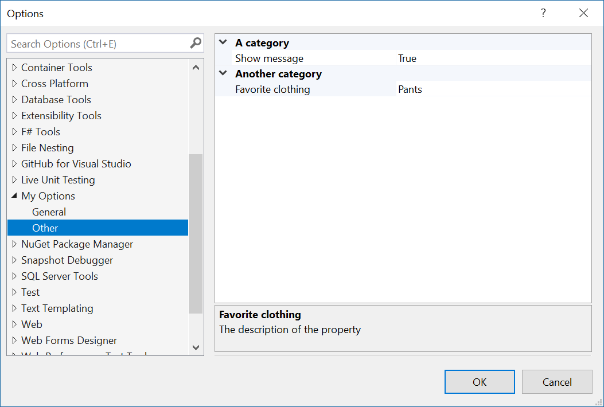

# Options example

**Applies to Visual Studio 2015 and newer**

This sample shows how to correctly specify and consume options for a Visual Studio extension that is both thread-safe and performant.

The goal is to use best practices to achieve the following:

* A simple way to provide custom options
* Expose the options in the **Tools -> Options** dialog
* Thread-safe way to access and modify the settings
* Both synchronous and asyncronous support
* No need to load the package for the settings to initialize

## Let's get started
The source code in this sample adds two options pages to the **Tools -> Options** dialog - *General* and *Other* which is nested under the *My Options* node. 



To make them show up in that dialog they have to be registered on the package class itself using the `ProvideOptionPage` attribute, like so:

```c#
[ProvideOptionPage(typeof(DialogPageProvider.General), "My Options", "General", 0, 0, true)]
[ProvideOptionPage(typeof(DialogPageProvider.Other), "My Options", "Other", 0, 0, true)]
public sealed class MyPackage : AsyncPackage
{
    ...
}
```

Both `GeneralOptions` ([source](src/Options/GeneralOptions.cs)) and `OtherOptions` ([source](src/Options/OtherOptions.cs)) are classes containing the settings as regular public properties. They are inheriting from the generic base class `BaseOptionModel` ([source](src/Options/BaseOptionModel.cs)).

```c#
internal class GeneralOptions : BaseOptionModel<GeneralOptions>
{
    [Category("My category")]
    [DisplayName("Message box text")]
    [Description("Specifies the text to show in the message box")]
    [DefaultValue("My message")]
    public string Message { get; set; } = "My message";
}
```

These classes can be used from anywhere in the extension when options are needed, but we need to provide a way to expose them to VS and for that we're going to create a class called `DialogPageProvider`:

```c#
internal class DialogPageProvider
{
    public class General : BaseOptionPage<GeneralOptions> { }
    public class Other : BaseOptionPage<OtherOptions> { }
}
```

The classes specified inside the `DialogPageProvider` class are inheriting from the second generic base class in this sample - `BaseOptionPage` ([source](src/Options/BaseOptionPage.cs)). It's sole responsibility is to function as the entry point for the **Tools -> Options** dialog.

That's it. We have now created custom options pages and registered them on the package. 

## Using the custom options
The options are ready to be consumed by our code and there are two ways to go about it:

### 1. From the UI thread
Whenever our code executes on the UI thread we can easily access the settings like so:

```c#
string message = GeneralOptions.Instance.Message;
```

This will throw when not on the UI thread so you'll catch any misuse during development. 

### 2. From a background thread
This is a thread-safe way to obtain the options instance. When in doubt, use it this way.


```c#
GeneralOptions options = await GeneralOptions.GetLiveInstanceAsync();
string message = options.Message;
```

See how it is being used from the [TextviewCreationListener.cs](src/TextviewCreationListener.cs) MEF component in the source code.

## Modify the options
You can programmatically modify the options like this:

```c#
GeneralOptions options = await GeneralOptions.GetLiveInstanceAsync();
options.Message = "My new message";
await options.SaveAsync();
```

The above method can be called in a syncronous way on the UI thread, like so:

```c#
GeneralOptions.Instance.Message = "My new message";
GeneralOptions.Instance.Save();
```

It is recommented to do it async if possible.

There you have it. Custom options using best practices.

## Futher reading
Read the docs for all the details surrounding these scenarios, but notice that while they do provide more detailed documentation, they don't follow the best practices outlined in this sample.

* [Creating an Options Page](https://docs.microsoft.com/en-us/visualstudio/extensibility/creating-an-options-page)
* [Using the Settings Store](https://docs.microsoft.com/en-us/visualstudio/extensibility/using-the-settings-store)
* [Writing to the User Settings Store](https://docs.microsoft.com/en-us/visualstudio/extensibility/writing-to-the-user-settings-store)