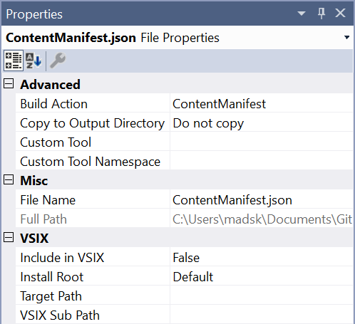

# Protocol handler sample

[](https://ci.appveyor.com/project/madskristensen/protocolhandlersample)

**Applies to Visual Studio 2017.6 and newer**

This sample shows how to associate a URI protocol with Visual Studio and handle the passed in URI. For instance, a link with a custom protocol (*such as vsph://anything/I/want*) will open Visual Studio and pass the URI to the extension.

## Specify minimum supported version
Since protocol handler support is new in Visual Studio 2017 Update 6, we need to specify that our extension requires that version or newer. We do that in the .vsixmanifest file like so:

```xml
<InstallationTarget Id="Microsoft.VisualStudio.Community" Version="[15.0.27413, 16.0)" />
```

*15.0.27413* is the full version string of Visual Studio 2017 Update 6.

See the full sample [.vsixmanifest file](src/source.extension.vsixmanifest).

## Register the protocol
The first thing we should do is to specify the protocol in our extension to let the Visual Studio extension installer register it with Windows. We do that by adding a .json file to our extension and set its Build Action property to *ContentManifest*.



The content of the .json file should look like this. Replace any instance of *vsph* with your own protocol name.

```json
{
  "$schema": "http://json.schemastore.org/vsix-manifestinjection",
  "urlAssociations": [
    {
      "protocol": "vsph",
      "displayName": "Visual Studio Protocol Handler Sample",
      "progId": "VisualStudio.vsph.[InstanceId]",
      "defaultProgramRegistrationPath": "Software\\Microsoft\\VisualStudio_[InstanceId]\\Capabilities"
    }
  ],
  "progIds": [
    {
      "id": "VisualStudio.vsph.[InstanceId]",
      "displayName": "Visual Studio Protocol Handler Sample",
      "path": "[InstallDir]\\Common7\\IDE\\devenv.exe",
      "arguments": "/MySwitch",
      "defaultIconPath": "[InstallDir]\\Common7\\IDE\\devenv.exe"
    }
  ]
}
```

Notice that the *#/progIds/arguments* property is set to **/MySwitch**. This means that Visual Studio will be started with a that command line argument and the URL will be added to that like so: `devenv.exe /MySwitch vsph://anything/I/want`

> Please note that for this to work, the extension must be a per-machine extension. Set this in the .vsixmanifest by specifying `<Installation AllUsers="true">`.

## Intercept the URI
Now we need our package class to load automatically when Visual Studio was started by the protocol handler. We do that by adding an attribute to the Package/AsyncPackage class:

```c#
[ProvideAppCommandLine("MySwitch", typeof(ProtocolPackage), Arguments = "1", DemandLoad = 1)]
public sealed class ProtocolPackage : AsyncPackage
{
    ...
}
```

With the `ProvideAppCommandLine` attribute in place, the package is automatically initialized when the `/MySwitch` command line argument was passed to `devenv.exe`.

We can then access the URI from the Package.InitializeAsync method:

```c#
protected override async Task InitializeAsync(CancellationToken cancellationToken, IProgress<ServiceProgressData> progress)
{
    await JoinableTaskFactory.SwitchToMainThreadAsync();

    var cmdline = await GetServiceAsync(typeof(SVsAppCommandLine)) as IVsAppCommandLine;

    ErrorHandler.ThrowOnFailure(cmdline.GetOption("MySwitch", out int isPresent, out string optionValue));

    if (isPresent == 1)
    {
        // If opened from a URL, then "optionValue" is the URL string itself
        System.Windows.Forms.MessageBox.Show(optionValue);
    }
}
```

See the full sample [package class](src/ProtocolPackage.cs).

And that's it. We now have an extension that can take action on custom protocol URIs. To test it out, [install this sample extension](http://vsixgallery.com/extension/88018116-8e87-4113-a1c0-db510a2aace0/) and then click [this link](https://tinyurl.com/vsph-sample).

## Further reading

- [Adding command line switches](https://docs.microsoft.com/en-us/visualstudio/extensibility/adding-command-line-switches)
- [VS 2017 version numbers and release dates](https://docs.microsoft.com/en-us/visualstudio/install/visual-studio-build-numbers-and-release-dates)