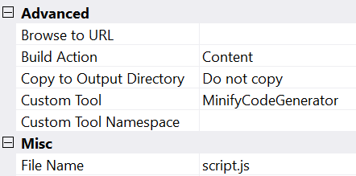
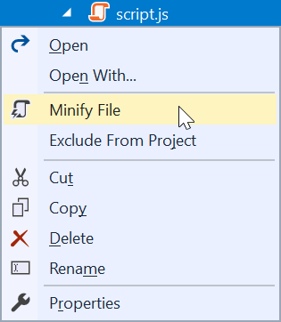

# Single File Generator sample

**Applies to Visual Studio 2017 and newer**

This example shows how to write a Single File Generator in a Visual Studio extension that will output a nested file when the parent file is modified.

Clone the repo to test out the sample in Visual Studio 2017 yourself.

## What is a Single File Generator
A Single File Generator is a mechanism that will auto-create and nest an output file when the source file changes. In this sample, the generator is applied to a **.js** file that will then output a **.min.js** file like so:


It is also known as a Custom Tool which can be manually set in the properties of supported files.



The most well-known examples of existing generators are the ones creating a strongly typed C#/VB nested file for .resx files.

Every time the file with the Custom Tool property is modified, the Single File Generator will execute to update the nested file. 

The nested file can be of any type - code, image, etc. - the sky is the limit.

## Let's get started
Before we begin, make sure you have created a VSIX project in Visual Studio. See how to [create a VSIX project](https://docs.microsoft.com/en-us/visualstudio/extensibility/extensibility-hello-world) if you don't already have one ready.

### Install NuGet package
The base classes for the Single File Generator are located in the [Microsoft.VisualStudio.TextTemplating.VSHost.15.0](https://www.nuget.org/packages/Microsoft.VisualStudio.TextTemplating.VSHost.15.0/) NuGet package, so go ahead and install that into your VSIX project.

We also need the [Nuglify](https://www.nuget.org/packages/NUglify/) NuGet package that can minify JavaScript.

### The generator
The generator is a simple class that inherits from the *BaseCodeGeneratorWithSite* and has 2 methods for us to implement.

```c#
using Microsoft.VisualStudio.TextTemplating.VSHost;

[Guid("82ca81c8-b507-4ba1-a33d-ff6cdad20e36")] // change this GUID
public sealed class MinifyCodeGenerator : BaseCodeGeneratorWithSite
{
  public override string GetDefaultExtension()
  {
    return ".min.js";
  }

  protected override byte[] GenerateCode(string inputFileName, string inputFileContent)
  {
    UglifyResult minified = Uglify.Js(inputFileContent);
    return Encoding.UTF8.GetBytes(minified.Code);
  }
}
```

[See full generator class in the source](src/Generators/MinifyGenerator.cs).

That's it, you now have a Single File Generator that writes a .min.js file with the minified content of the source .js file. Now we must register the generator to make it work.

### Registering the generator
Decorate your *Package* class with the `ProvideCodeGenerator` attribute.

```c#
[ProvideCodeGenerator(typeof(MinifyCodeGenerator), nameof(MinifyCodeGenerator), "Minifies JavaScript", true)]
public class VSPackage : AsyncPackage
{
  ...
}
```

[See full Package class in the source](src/VSPackage.cs).

> Note: if you don't have a *Package* class, add one to your project using the Add New Item dialog. The template is called *Visual Studio AsyncPackage* in VS 2017.7

Now the generator is registered, and you can now manually give the Custom Tool property on .js files the *MinifyCodeGenerator* value.

That's it. We've now implemented a Single File Generator that minifies JavaScript files.

However, it would be much easier if we give our users a command in the context-menu of files in Solution Explorer to add the value for them so they don't have to type *MinifyCodeGenerator* in the Property Grid manually.

### Add the command button
In the .VSCT file you must specify a new button. It could look like this:

```c#
<Button guid="guidPackageCmdSet" id="ApplyCustomToolId" priority="0x0100" type="Button">
  <Parent guid="guidSHLMainMenu" id="IDG_VS_CTXT_ITEM_INCLUDEEXCLUDE"/>
  <Strings>
    <ButtonText>Minify File</ButtonText>
  </Strings>
</Button>
```

[See full .vsct file in the source](src/VSCommandTable.vsct).

That will place the button in the context-menu in Solution Explorer.



Then we need to add the command handler C# file. It will look similar to this:

```c#
internal sealed class ApplyCustomTool
{
    private const int _commandId = 0x0100;
    private static readonly Guid _commandSet = new Guid("4aaf93c0-70ae-4a4b-9fb6-1ad3997a9adf");
    private static DTE _dte;
    
    public static async Task InitializeAsync(AsyncPackage package)
    {
        _dte = await package.GetServiceAsync(typeof(DTE)) as DTE;

        var commandService = await package.GetServiceAsync((typeof(IMenuCommandService))) as IMenuCommandService;
        var cmdId = new CommandID(_commandSet, _commandId);
        var cmd = new MenuCommand(OnExecute, cmdId)
        commandService.AddCommand(cmd);
    }

    private static void OnExecute(object sender, EventArgs e)
    {
        ProjectItem item = _dte.SelectedItems.Item(1).ProjectItem;        
        item.Properties.Item("CustomTool").Value = nameof(MinifyCodeGenerator);
    }
}
```

[See full command handler in the source](src/Commands/ApplyCustomTool.cs).

And then finally initialize the command handler from the *Package* initialization method.

```c#
protected override async Task InitializeAsync(CancellationToken cancellationToken, IProgress<ServiceProgressData> progress)
{
    await ApplyCustomTool.InitializeAsync(this);
}
```

[See full Package class in the source](src/VSPackage.cs).

### Single File Generators in the wild
Here are more samples of open source extensions implementing Single File Generators.

* [VSIX Synchronizer](https://github.com/madskristensen/VsixSynchronizer)
* [Extensibility Tools](https://github.com/madskristensen/extensibilitytools)

## License
[Apache 2.0](LICENSE)