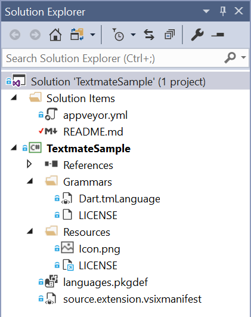
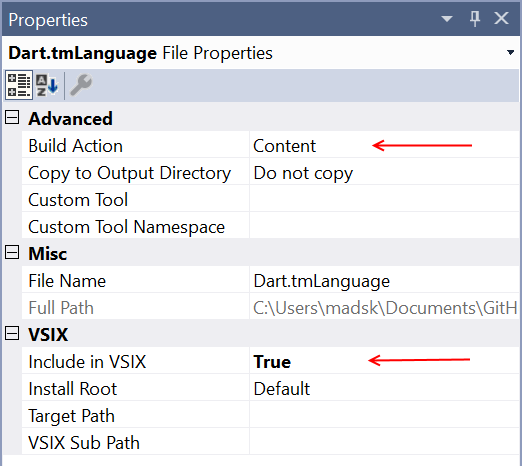
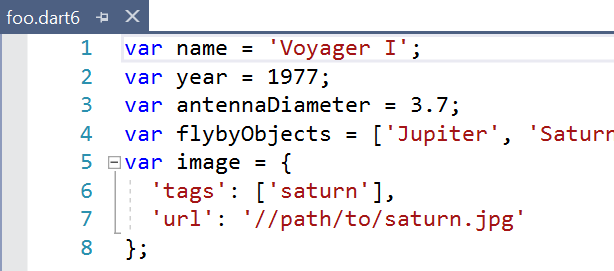

# Textmate grammar in Visual Studio

This is a sample project that demonstrates how to ship Textmate grammars inside Visual Studio extensions.

## Ship your own Textmate bundle
Here is how to ship any existing Textmate bundle as a Visual Studio extension.

### Step 1 - Clone this project
Clone or download this project. Find it [on GitHub](https://github.com/madskristensen/TextmateSample).

Then open the solution (.sln file) in Visual Studio 2017. It should look similar to this:

### Step 2 - Modify metadata
Open the `source.extension.vsixmanifest` file and update all the metadata such as name, author etc. and **make sure to use a new GUID as the Product ID**.

### Step 3 - Update license
Open `/Resources/LICENSE` file and update it to your needs. If the Apache 2.0 license works for you then just update the name in the top of the file.

### Step 4 - Add the Textmate files
Delete the files inside the `Grammars` folder and add your own `.tmLanguage`, `.tmTheme`, `.plist` and/or `.json` files from the Textmate bundle. They are sometimes found inside a folder called `Syntaxes` in the Textmate bundle.

> Note that *snippets*, *commands* and *preferences* sometimes found in Textmate bundles are not supported by Visual Studio and should not be added to this project.

Make sure to set the **Build Action** to *Content* and the **Include in VSIX** to *True* for each of the Textmate files in the `/Grammars` folder.

Select all the files and hit F4 to open the Properties tool window.

### Step 5 - Update languages.pkgdef
This file registers the Textmate bundle with Visual Studio and associates the file extensions with icons.

## Verify it works
To test and verify that the Textmate grammar files work, simple hit **Ctrl+F5** to launch a new instance of Visual Studio that will automatically have your extension installed.

Open a file with a file extension matching that of the Textmate grammar file and verify that it is colorized.

